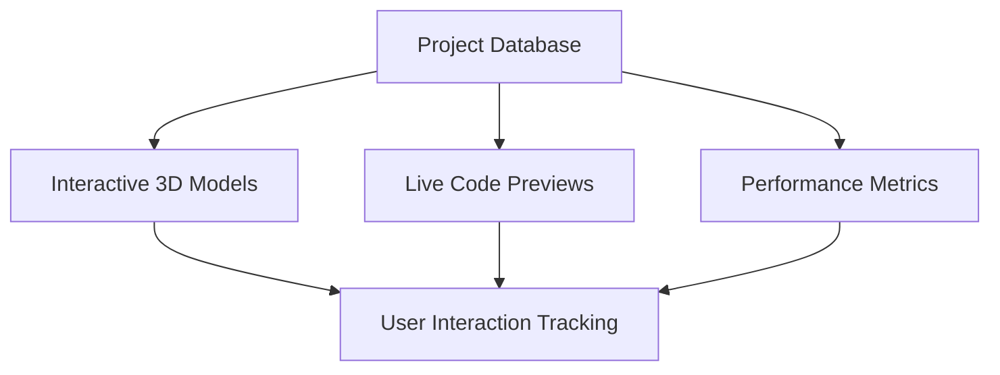
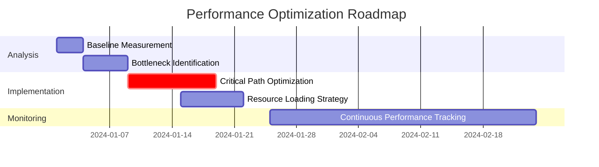
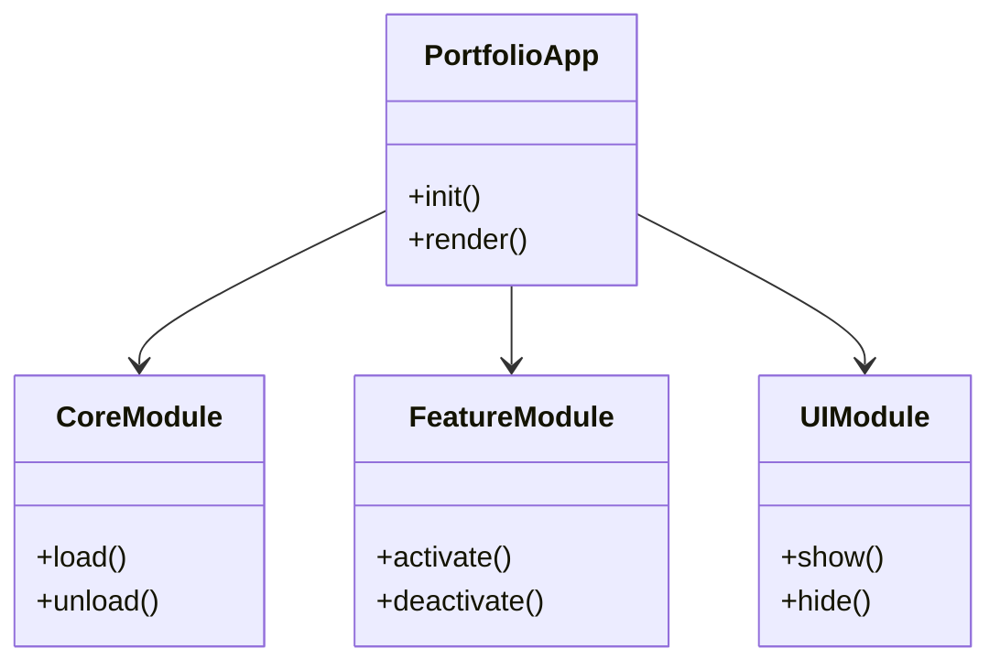

# Portfolio App Software Planning Proposal 🚀

## Overview

This document outlines comprehensive ideas and features for enhancing your portfolio application using the software planning methodology. The proposal is structured to provide actionable insights for improving your portfolio app's functionality, user experience, and technical architecture.

## Current Portfolio Analysis

Based on the project structure, your portfolio currently includes:

- **Core Components**: About, Contact, Product, Resume, Settings pages
- **Advanced Features**: 3D demos, AI Assistant, Performance Monitoring, PWA capabilities
- **Technical Stack**: React, TypeScript, Vite, Tailwind CSS
- **Testing**: Playwright, Vitest
- **Deployment**: AWS Amplify, GitHub integration

## Proposed Enhancements

### 1. Interactive Project Showcase System

**Goal**: Create an engaging way to display projects with interactive elements

**Implementation Plan**:



**Todo Items**:
- [ ] **Enhanced 3D Project Visualization** (Complexity: 7)
  - Integrate Three.js with React for interactive 3D project models
  - Add touch/gesture support for mobile devices
  - Implement project rotation and zoom functionality

- [ ] **Live Code Preview System** (Complexity: 6)
  - Create sandboxed code environments for project demos
  - Implement syntax highlighting and error checking
  - Add collaborative coding features

- [ ] **Project Analytics Dashboard** (Complexity: 5)
  - Track user engagement with each project
  - Visualize interaction patterns and popularity
  - Generate insights for portfolio optimization

**Code Example**:
```typescript
// Enhanced 3D Project Component
const InteractiveProject = ({ projectData }) => {
  const [rotation, setRotation] = useState({ x: 0, y: 0 });
  const [selectedFeature, setSelectedFeature] = useState(null);

  const handlePointerMove = (e) => {
    // Calculate rotation based on mouse/touch position
    const x = (e.clientX / window.innerWidth) * 2 - 1;
    const y = (e.clientY / window.innerHeight) * 2 - 1;
    setRotation({ x: y * Math.PI, y: x * Math.PI });
  };

  return (
    <div className="project-container" onPointerMove={handlePointerMove}>
      <Canvas>
        <ambientLight intensity={0.5} />
        <pointLight position={[10, 10, 10]} />
        <ProjectModel
          geometry={projectData.geometry}
          rotation={rotation}
          onFeatureSelect={setSelectedFeature}
        />
      </Canvas>
      <ProjectInfoPanel
        project={projectData}
        selectedFeature={selectedFeature}
      />
    </div>
  );
};
```

### 2. AI-Powered Portfolio Assistant

**Goal**: Implement an intelligent assistant to guide visitors through your portfolio

**Implementation Plan**:

```typescript
interface AIAssistantFeatures {
  personalizedRecommendations: {
    algorithm: 'collaborative-filtering',
    dataSources: ['user-behavior', 'project-tags', 'popularity']
  };
  naturalLanguageInterface: {
    nlpModel: 'transformer-based',
    responseTime: '<500ms'
  };
  contextAwareHelp: {
    contextTypes: ['project-view', 'resume-view', 'contact-form'],
    helpModes: ['proactive', 'reactive', 'educational']
  };
}
```

**Todo Items**:
- [ ] **Context-Aware Recommendation Engine** (Complexity: 8)
  - Analyze user behavior patterns
  - Implement machine learning for personalized suggestions
  - Create adaptive learning system

- [ ] **Natural Language Processing Interface** (Complexity: 7)
  - Integrate with language models
  - Implement intent recognition
  - Add conversational memory

- [ ] **Proactive Assistance System** (Complexity: 6)
  - Detect user confusion patterns
  - Offer timely help and guidance
  - Implement progressive disclosure

**Code Example**:
```typescript
// AI Assistant Context Analyzer
class PortfolioAIAssistant {
  private userContext: UserContext;
  private projectKnowledge: ProjectKnowledgeBase;

  constructor() {
    this.userContext = new UserContext();
    this.projectKnowledge = new ProjectKnowledgeBase();
  }

  async analyzeUserIntent(query: string): Promise<AssistantResponse> {
    // Use NLP to understand user intent
    const intent = await this.nlpService.analyze(query);

    // Get relevant context
    const context = this.userContext.getCurrentContext();

    // Generate appropriate response
    const response = this.responseGenerator.create(
      intent,
      context,
      this.projectKnowledge
    );

    // Update user model
    this.userContext.updateFromInteraction(intent, response);

    return response;
  }

  async provideProactiveHelp(): Promise<HelpSuggestion[]> {
    const currentContext = this.userContext.getCurrentContext();
    const potentialIssues = this.issueDetector.analyze(currentContext);

    return potentialIssues.map(issue => ({
      type: 'proactive-help',
      message: `It looks like you might be interested in ${issue.relatedTopic}`,
      suggestions: this.projectKnowledge.getRelatedProjects(issue.relatedTopic),
      confidence: issue.confidenceScore
    }));
  }
}
```

### 3. Advanced Performance Optimization Suite

**Goal**: Implement comprehensive performance monitoring and optimization

**Implementation Plan**:



**Todo Items**:
- [ ] **Automated Performance Profiling** (Complexity: 6)
  - Implement continuous performance monitoring
  - Create automated bottleneck detection
  - Generate optimization recommendations

- [ ] **Adaptive Resource Loading** (Complexity: 7)
  - Implement intelligent preloading strategies
  - Create network-aware loading algorithms
  - Add predictive resource fetching

- [ ] **Performance Impact Visualization** (Complexity: 5)
  - Develop interactive performance dashboards
  - Create real-time metrics visualization
  - Implement comparative analysis tools

**Code Example**:
```typescript
// Adaptive Performance Optimizer
class PerformanceOptimizer {
  private metrics: PerformanceMetrics;
  private strategies: OptimizationStrategy[];

  constructor() {
    this.metrics = new PerformanceMetrics();
    this.strategies = [
      new CriticalPathOptimizer(),
      newResourcePreloader(),
      newCodeSplittingStrategy()
    ];
  }

  async analyzeAndOptimize(): Promise<OptimizationReport> {
    // Collect current performance data
    const currentMetrics = await this.metrics.collect();

    // Analyze bottlenecks
    const bottlenecks = this.analyzer.identifyBottlenecks(currentMetrics);

    // Apply appropriate strategies
    const optimizations = this.strategies
      .filter(strategy => strategy.appliesTo(bottlenecks))
      .map(strategy => strategy.apply(currentMetrics));

    // Generate report
    return {
      baseline: currentMetrics,
      bottlenecks,
      optimizations,
      projectedImprovement: this.calculateImprovement(
        currentMetrics,
        optimizations
      )
    };
  }

  async monitorContinuously(): Promise<void> {
    // Set up continuous monitoring
    this.metrics.startContinuousMonitoring();

    // Listen for performance events
    this.metrics.on('performanceChange', (change) => {
      if (change.impact > PERFORMANCE_THRESHOLD) {
        this.triggerOptimization(change);
      }
    });
  }
}
```

### 4. Collaborative Portfolio Features

**Goal**: Add social and collaborative elements to your portfolio

**Implementation Plan**:

```typescript
interface CollaborativeFeatures {
  realtimeInteraction: {
    technologies: ['WebRTC', 'WebSockets'],
    useCases: ['live-demos', 'collaborative-coding', 'Q&A-sessions']
  };
  communityIntegration: {
    platforms: ['GitHub', 'LinkedIn', 'Twitter'],
    features: ['social-sharing', 'comments', 'reactions']
  };
  feedbackSystem: {
    types: ['ratings', 'comments', 'detailed-reviews'],
    moderation: 'AI-assisted'
  };
}
```

**Todo Items**:
- [ ] **Live Collaboration System** (Complexity: 8)
  - Implement WebRTC for real-time interaction
  - Create collaborative coding environments
  - Add live Q&A functionality

- [ ] **Social Integration Hub** (Complexity: 6)
  - Unified social media connectivity
  - Cross-platform content sharing
  - Social analytics dashboard

- [ ] **Advanced Feedback System** (Complexity: 5)
  - Multi-dimensional rating system
  - AI-powered sentiment analysis
  - Feedback-driven improvements

**Code Example**:
```typescript
// Collaborative Session Manager
class CollaborationManager {
  private sessions: Map<string, CollaborationSession>;
  private signalingServer: WebRTCSignalingServer;

  constructor() {
    this.sessions = new Map();
    this.signalingServer = new WebRTCSignalingServer();
  }

  async startCollaborationSession(
    projectId: string,
    userId: string
  ): Promise<CollaborationSession> {
    // Create new session
    const session = new CollaborationSession(projectId);

    // Set up WebRTC connection
    const connection = await this.signalingServer.establishConnection(userId);
    session.addConnection(connection);

    // Initialize collaborative environment
    await session.initializeEnvironment();

    // Store session
    this.sessions.set(session.id, session);

    return session;
  }

  async joinCollaborationSession(
    sessionId: string,
    userId: string
  ): Promise<CollaborationSession> {
    const session = this.sessions.get(sessionId);
    if (!session) throw new Error('Session not found');

    // Establish connection
    const connection = await this.signalingServer.establishConnection(userId);
    session.addConnection(connection);

    // Sync state
    await session.syncStateToUser(userId);

    return session;
  }

  async handleCollaborativeEditing(
    sessionId: string,
    userId: string,
    changes: CodeChanges
  ): Promise<void> {
    const session = this.sessions.get(sessionId);
    if (!session) throw new Error('Session not found');

    // Apply changes
    session.applyChanges(userId, changes);

    // Broadcast to all participants
    await session.broadcastChanges(changes);

    // Update version history
    session.addToHistory(changes);
  }
}
```

## Technical Architecture Recommendations

### 1. Modular Component System



### 2. Performance Optimization Strategy

```typescript
// Comprehensive Performance Strategy
const performanceStrategy = {
  loading: {
    lazyLoading: true,
    preloading: {
      criticalResources: ['main-css', 'core-js'],
      predictive: {
        enabled: true,
        predictionWindow: 5000 // 5 seconds
      }
    },
    codeSplitting: {
      strategy: 'route-based',
      chunkSizeTarget: '50kb'
    }
  },
  rendering: {
    virtualization: {
      listItems: true,
      largeComponents: true
    },
    debouncing: {
      resizeEvents: 100,
      scrollEvents: 50
    },
    animationOptimization: {
      useWillChange: true,
      reduceMotionSupport: true
    }
  },
  caching: {
    serviceWorker: {
      cacheFirst: ['static-assets'],
      networkFirst: ['api-calls'],
      staleWhileRevalidate: ['dynamic-content']
    },
    localStorage: {
      sessionData: true,
      userPreferences: true
    }
  }
};
```

## Implementation Roadmap

### Phase 1: Foundation (Weeks 1-2)
- [ ] Set up modular architecture
- [ ] Implement core performance monitoring
- [ ] Create basic AI assistant framework
- [ ] Establish collaboration infrastructure

### Phase 2: Core Features (Weeks 3-6)
- [ ] Develop interactive project showcase
- [ ] Implement AI-powered recommendations
- [ ] Build performance optimization tools
- [ ] Create collaborative features

### Phase 3: Advanced Features (Weeks 7-10)
- [ ] Add predictive analytics
- [ ] Implement adaptive UI
- [ ] Develop advanced collaboration tools
- [ ] Create comprehensive testing suite

### Phase 4: Polish & Optimization (Weeks 11-12)
- [ ] Performance tuning
- [ ] User experience refinement
- [ ] Accessibility improvements
- [ ] Documentation and tutorials

## Success Metrics

```typescript
interface PortfolioSuccessMetrics {
  engagement: {
    averageSessionDuration: '>3 minutes',
    bounceRate: '<20%',
    pagesPerSession: '>5'
  };
  performance: {
    loadTime: '<1.5 seconds',
    timeToInteractive: '<2 seconds',
    lighthouseScore: '>95'
  };
  conversion: {
    contactFormSubmissions: '>10% of visitors',
    projectInquiries: '>5% of visitors',
    socialShares: '>15% of visitors'
  };
  technical: {
    uptime: '99.9%',
    errorRate: '<0.1%',
    apiResponseTime: '<300ms'
  };
}
```

## Risk Assessment & Mitigation

| Risk Category | Potential Issues | Mitigation Strategy |
|--------------|------------------|---------------------|
| **Technical** | Complexity overload, Performance bottlenecks | Modular development, Continuous profiling, Incremental rollout |
| **User Experience** | Overwhelming features, Confusing navigation | User testing, Progressive disclosure, Clear documentation |
| **Integration** | API compatibility, Third-party service issues | Comprehensive testing, Fallback mechanisms, Service monitoring |
| **Performance** | Resource-intensive features, Memory leaks | Performance budgeting, Memory profiling, Lazy loading |
| **Security** | Data exposure, Injection vulnerabilities | Security audits, Input validation, Encryption |

## Recommendations for Immediate Implementation

1. **Start with Performance Foundation**:
   - Implement basic performance monitoring
   - Set up code splitting and lazy loading
   - Establish performance budgets

2. **Core AI Assistant**:
   - Begin with simple recommendation engine
   - Implement basic natural language processing
   - Create foundation for context awareness

3. **Interactive Project Showcase**:
   - Start with enhanced 3D visualization
   - Add basic interaction tracking
   - Implement project analytics

4. **Collaboration Infrastructure**:
   - Set up WebRTC signaling server
   - Create basic session management
   - Implement simple collaborative features

## Conclusion

This comprehensive software planning proposal outlines a strategic approach to enhancing your portfolio application with advanced features while maintaining performance, usability, and technical excellence. The modular implementation plan allows for incremental development and testing, ensuring that each component can be thoroughly evaluated before integration.

The proposed enhancements focus on creating an engaging, interactive, and intelligent portfolio experience that showcases your technical skills while providing real value to visitors. By implementing these features systematically, you can transform your portfolio from a static showcase into a dynamic, interactive platform that demonstrates your expertise in modern web development technologies.

**Next Steps**:
1. Prioritize features based on your specific goals
2. Create detailed technical specifications for each component
3. Implement a phased development and testing approach
4. Continuously monitor performance and user engagement
5. Iterate based on real-world usage data and feedback